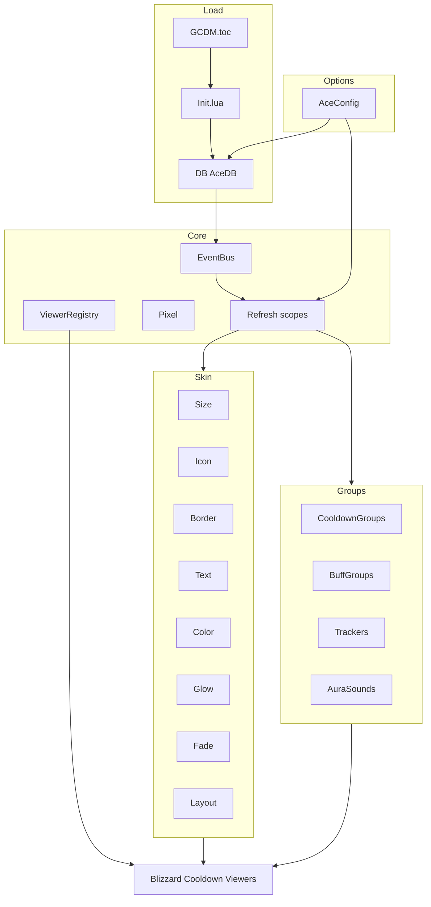

# GCDM — план (maintainable rewrite ~80% AyijeCDM)

**Статус:** утверждён к реализации  
**Цель:** лёгкий в поддержке аддон-скин/расширение Blizzard Cooldown Manager  
**Целевая версия клиента:** Retail `12.1.0` (`## Interface: 120100`)  
**API-контекст:** Midnight — Secret Values, Duration Objects; в 12.1 — AuraContainer / AuraButton для кастомных аур  

**Референс фич:** AyijeCDM 3.88 (discontinued)  
**Юридически:** AyijeCDM — All Rights Reserved. **Код не копируем.** Чистый рерайт по списку возможностей и публичному Blizzard API.

---

## 1. Продукт

GCDM (Great / Guild / Game Cooldown Manager — рабочее имя папки) — узкий аддон:

- кастомизирует **Blizzard Cooldown Viewer** (Essential / Utility / Buff Icons / Buff Bars);
- даёт **свои группы** (bands) и **свободные иконки** вне фиксированных viewer’ов;
- **не** тащит полный suite resource/cast bars как у Ayije (это основной источник сложности и ломкости).

Slash: `/gcdm`  
SavedVariables: `GCDMDB`

---

## 2. Что входит в «80%» (MVP → v1)

### P0 — ядро скинов (обязательно)

| Фича | Источник в Ayije (модули) | Как в GCDM |
|------|---------------------------|------------|
| Размер иконок per viewer / per row | Defaults `sizeEss*`, `sizeUtility`, `sizeBuff` | `Skin.Size` |
| Spacing, columns, growth, wrap | Layout | `Layout` |
| Icon zoom / crop | Style | `Skin.Icon` |
| Pixel border (толщина, цвет) | Border | `Skin.Border` |
| Шрифты: CD / stacks / charges / keybind | Style + Keybinds | `Skin.Text` |
| Цвета (десат, swipe, текст) | Style | `Skin.Color` |
| Custom glow (цвет, тип, ready/proc) | Glow / GlowDirector + LibCustomGlow | `Glow` |
| Fading (OOC / no target) | Fading | `Fade` |
| Refresh pipeline по scope | Init RefreshCallbacks | `Core.Refresh` scopes: `STYLE`, `LAYOUT`, `GLOW`, `GROUPS` |

### P1 — группы и трекеры (v1)

| Фича | Примечание |
|------|------------|
| Custom cooldown groups (N bands) | свои контейнеры, anchor to Essential/Utility/Buff/screen |
| Free icons (без привязки к band) | группа с `anchorTarget = screen` + per-icon offset |
| Buff group split / per-group options | упрощённый BuffGroups |
| Trinkets / Racials / Defensives trackers | один общий `Tracker` base, 3 пресета |
| Aura appear sound per group | `Skin.AuraSounds` / `AddAuraSound` (apply/stack/remove; без порога N стаков) |
| Profiles + import/export | AceDB + `Core/ProfileShare` (`!GCDM:1!`) |
| Edit Mode coexistence | не ломать Blizzard movers; scale lock = 1 на managed frames |

### Documented CDM debt (keep)
- Empty-icon park (`Skin.PARK_OFFSET`), BuffBar deferred mutate, Icon flash/bling suppress, PressOverlay active poll

### P2 — «оставшиеся 20%» (не в v1)

- ~~Resource bars + class conditions + tags~~ → **частично в v1.1:** тонкие `Skin.PowerBar` + `Skin.AuraSounds`. Полный suite (tags, class conditions, cast bar, custom aura strips) — всё ещё P2  
- **Невозможно в бою (12.1):** условия `stacks == N`, показ только при ≥N стаках, glow способности от числа стаков бафа — аддон не читает `applications` для ветвления  
- Player cast bar + conditional anchors  
- Externals  
- WagoUI  
- Rotation assist / press overlay (можно тонкий P1.5 позже)  
- Полная миграция `Ayije_CDMDB` schema 23  
- Все локали кроме `enUS` + `ruRU`

---

## 3. Стек

| Слой | Выбор | Почему |
|------|--------|--------|
| Язык | Lua 5.1 (WoW) | нативно |
| Каркас | свой namespace `GCDM` + тонкий event bus | меньше магии, чем полный AceAddon; проще debug |
| DB / профили | **AceDB-3.0** (embedded) | профили без самодельного ада |
| Опции UI | **AceConfig-3.0 + AceConfigDialog-3.0** + `/gcdm` | быстрее поддержки, чем кастомный ConfigFrame на 29 файлов |
| Медиа | LibSharedMedia-3.0 | шрифты/текстуры |
| Glow | LibCustomGlow-1.0 | стандарт для custom glow |
| Опционально | LibStub, CallbackHandler | зависимости libs |

**Не берём:** копипаст Ayije Options UI, Resources/CastBar деревья, schemaVersion-миграции Ayije.

---

## 4. Архитектура



### Правила поддержки (ритм)

1. **Один модуль = одна ответственность**; публичный API только через `GCDM:` методы.  
2. **Никаких скрытых OnUpdate** без idle-stop; тики только пока есть активные анимации/фейды.  
3. **Refresh(scope)** — единственная точка применения настроек; опции только пишут в DB и зовут Refresh.  
4. **Viewer hooks** — централизованно в `ViewerRegistry` / `Skin.Apply(frame)`, не размазывать `hooksecurefunc` по файлам.  
5. **Secret Values / Duration Objects** — основной путь с первого дня (`SetCooldownFromDurationObject`, без арифметики по secret). Для кастомных аур в 12.1 — `AuraContainer` / `AuraButton`, не сырой CLEU/UnitAura для combat-логики.  

6. **Не трогать** чужой All Rights Reserved код; читать Ayije только как чеклист фич.  
7. Изменения — по одному модулю, проверка в игре после каждого: `/reload` + Essential/Utility/Buff.  
8. `PROJECT_INDEX.md` локальный, в `.gitignore`.

---

## 5. Структура репозитория (цель)

```
GCDM/
  GCDM.toc
  Init.lua
  Core/
    Constants.lua
    EventBus.lua
    Refresh.lua
    Pixel.lua
    ViewerRegistry.lua
    SpellUtil.lua
  Skin/
    Size.lua Icon.lua Border.lua Text.lua Color.lua
    Glow.lua Fade.lua Layout.lua
  Groups/
    CooldownGroups.lua BuffGroups.lua Trackers.lua AuraSounds.lua
  DB/
    Defaults.lua Schema.lua
  Options/
    Options.lua          -- AceConfig tree
  Libs/                  -- embeds.xml (Ace*, LSM, LibCustomGlow, LibStub, CH)
  Locales/
    enUS.lua ruRU.lua
  PLAN.md                -- этот документ
  .gitignore
  .cursor/rules/
    gcdm-rhythm.mdc
```

Один аддон (без отдельного `*_Options` LoadOnDemand на старте) — проще. Options можно вынести позже.

---

## 6. Фазы реализации

### Фаза 0 — каркас

- [x] `GCDM.toc` `Interface: 120100`
- [x] `Init.lua` + AceDB + defaults-заглушка
- [x] `/gcdm` открывает AceConfig (General + Profiles)
- [x] `PROJECT_INDEX.md` локально
- [x] Vendored Ace3 subset in `Libs/`

### Фаза 1 — Skin P0

- [x] ViewerRegistry: найти/кэшировать Essential/Utility/Buff/BuffBar
- [x] Size / Spacing / Layout apply (size done; spacing/layout next)
- [x] Border + Icon zoom
- [ ] Text (CD, stacks, charges, keybind)
- [x] Glow (proc alert) через LibCustomGlow; ready/aura — позже
- [ ] Fade OOC

### Фаза 2 — Groups P1

- [ ] N cooldown groups + screen/free placement
- [ ] Buff groups (split)
- [ ] Trackers: trinket / racial / defensive
- [ ] AuraSounds
- [ ] Profiles import/export

### Фаза 3 — polish

- [ ] Pixel-perfect snap
- [ ] Combat lockdown safety
- [ ] ruRU
- [ ] Проверка на AuraContainer/AuraButton там, где кастомные buff groups не могут опереться только на Blizzard Buff viewers
- [ ] Regression после патч-диффов `C_CooldownViewer` / Edit Mode

---

## 7. Критерии «80% готово»

1. Essential + Utility + Buff Icons визуально кастомизируются (size/border/zoom/fonts/glow/fade).  
2. Можно создать ≥3 своих band’а с разными размерами иконок.  
3. Есть free icon / screen-anchored группа.  
4. Профили сохраняются между сессиями.  
5. Нет resource/cast bar модулей в дереве.  
6. Новый контрибьютор понимает Refresh scopes за <15 минут по `PLAN.md` + rhythm rule.

---

## 8. Риски

| Риск | Митигация |
|------|-----------|
| Ломкие Blizzard mixin’ы на патче | тонкий Skin.Apply; минимум monkey-patch |
| Taint / combat | отложенный apply через `PLAYER_REGEN_ENABLED` |
| 12.1 aura lockdown (Forbidden/Secret Aspects) | кастомные ауры только через AuraContainer/AuraButton; скин Blizzard viewers предпочтительнее сырого трекинга |
| Duration Objects / secret cooldown values | только Blizzard duration APIs, без чтения/веток по secret numbers |
| Желание «просто форкнуть Ayije» | запрещено лицензией; только clean-room |

---

## 9. Решение по имени / папке

Рабочая папка: `GCDM`.  
Title в TOC: `|cFF3bb273GCDM|r` (цвет можно сменить).  
Не использовать имя `Ayije_CDM` в Title/SavedVariables.
